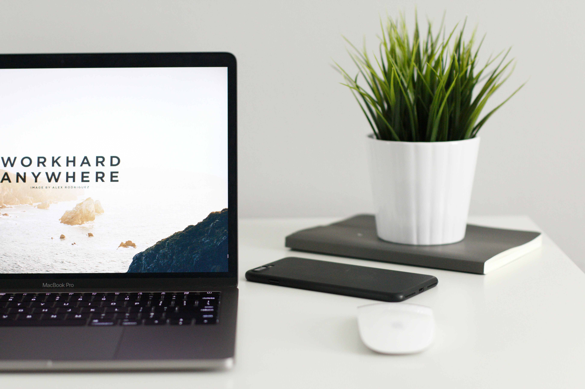
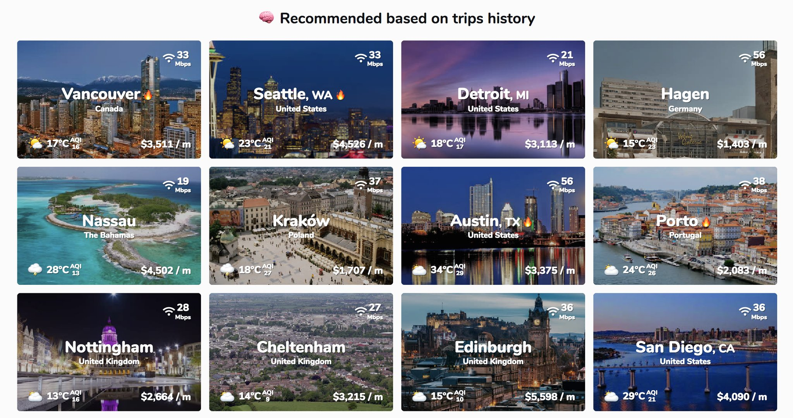

# Remote life is the dream.

When I first heard of remote work, I was green out of college, blowing every paycheck, squeezing independence out of adulthood like the lime on a midnight taco.

I imagined the possibilities of working remotely: the swanky lounge of a cruise ship, a hammock overlooking the Caribbean, the front porch of a Himalayan mountain cabin.

I'd become a [digital nomad](https://levels.io/future-of-digital-nomads/), capitalizing on favorable currency rates, meeting and becoming fast friends with strangers at a dive bar in Tokyo.  I wouldn't need a mortgage, student loans, and a lengthy commute to impress people I didn't like.

What if I lived _my_ dream, not the collapsing American one?

_credit: nomadlist.com_

# Quality of life is the reality.

Fast forward to now: I'm married, saving every paycheck, and squeezing the time out of every day like the lime on a homemade taco.  I smile when I think of the possibility of family picnics, finishing my day out on the patio, and meeting for afternoon coffee and sushi with my best friends.

When I started working remote, the curious conversations began: some skeptical, some celebratory, some jealous.  Despite a multitude of [research](https://blog.shrm.org/sites/default/files/reports/WorkFlex%20Spotlight.pdf) [challenging](https://blog.hubstaff.com/why-remote-work-is-better/) [onsite](https://www.inc.com/brian-de-haaff/only-7-of-office-workers-are-productive-but-most-are-miserable.html) [office](https://qz.com/891537/if-you-dont-trust-your-employees-to-work-remotely-you-shouldnt-have-hired-them-in-the-first-place) [environments](https://www.forbes.com/sites/jeffboss/2017/05/19/why-ibms-move-to-rein-in-remote-workers-isnt-the-answer/#79d234043de0), most people dismissed the idea.  My barber joked about watching Netflix all day, my doctor shook her head sadly that it'd never work with her schedule, and my family asked if I would ever shower again (that's another story).

If you believe something's impossible, you guarantee it always will be.

# Creating reality isn't easy.

Remote working isn't without its [challenges](https://qz.com/775751/digital-nomad-problems-nomadlist-and-remoteok-founder-pieter-levels-explains-why-he-has-quit-the-nomadic-lifestyle/).

I can spend a few hours alone, especially with a book and a hammock.

I can spend a few days alone, like thru hiking 80 miles through the Georgia mountains.

I can't spend a few _months_ alone without organizing checklists, discovering new motivations, pushing the limits of my social engagement, and curating restful and healthy habits.  I have to overcommunicate and document _everything_, in the most visible space available.  I have to set personal and professional expectations, like core working hours and dedicated office space.  I have to take midday walks to bounce out of a funk.  I have to meet annually IRL with my coworkers to reinforce the important things.

Dreaming about remote work is easy.  Making the impossible possible is hard.

It's also completely worth it.

_Editor's note: Jason Fried and David Hansson's [Remote](https://rachelbaskerville.com/reflections-on-remote-office-not-required-from-the-perspective-of-people-ops-on-a-small-remote-968f6e921b1c) is a must-read if you're considering the remote life._
