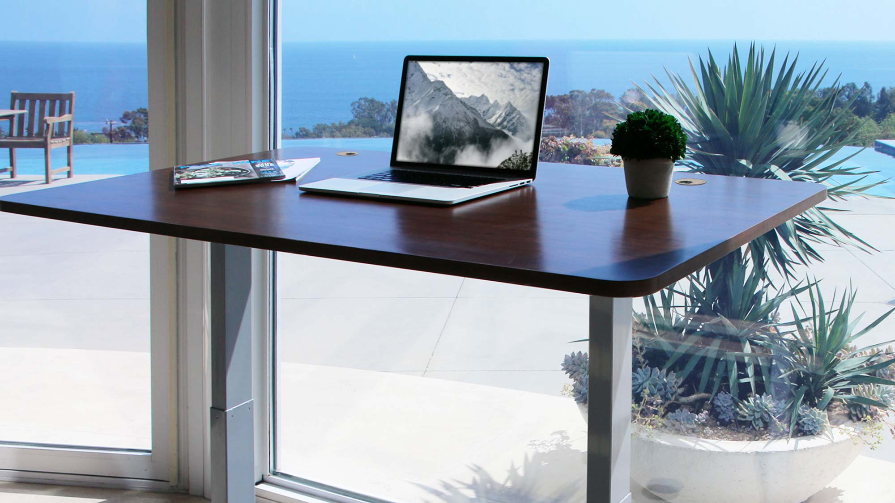
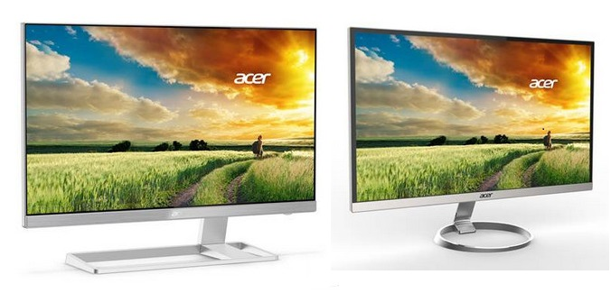
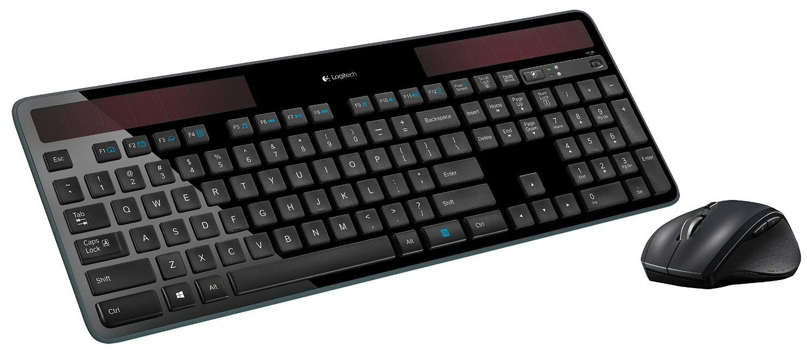
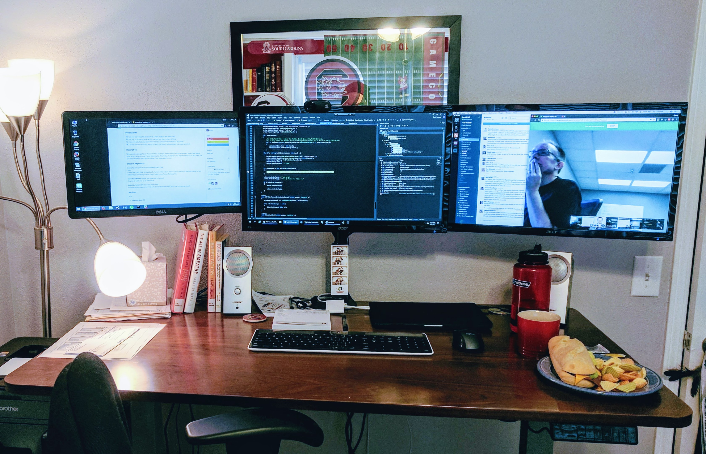
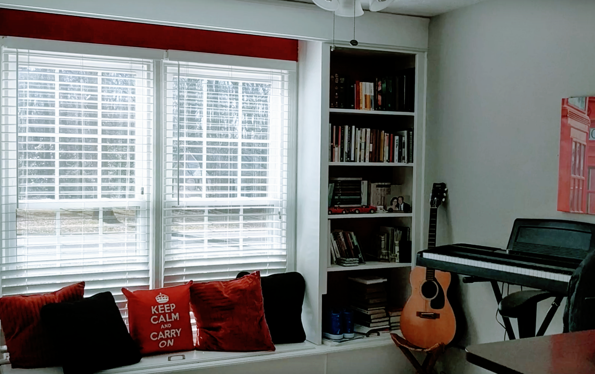

## What would your perfect office look like?  Where are you the most productive?  Where are you the most creative? 

I've been obsessed with productivity since college.  I'd like to think it was a learned discipline, that I _had to_ be productive to balance a full school term and part-time job.  I _had to_ be productive at my first job, then at my second job, to prove I could apply what I learned.  I _had to_ make other teams productive at my third job to justify my position.

# The lie.

My all day, every day zone of productivity doesn't exist.  Working over breaks, pushing through [exhaustion](https://www.huffingtonpost.com/jonathan-chan/3-scientifically-backed-r_b_14509568.html), and working 40+ hours creates [subpar results](https://www.alternet.org/story/154518/why_we_have_to_go_back_to_a_40-hour_work_week_to_keep_our_sanity).  

We work best in cycles: bursts of productivity followed by short [rest periods](https://www.theatlantic.com/business/archive/2014/09/science-tells-you-how-many-minutes-should-you-take-a-break-for-work-17/380369).  There's a reason your brain [creatively solves problems](http://content.time.com/time/magazine/article/0,9171,1147152,00.html) in the shower.

# The truth.

"Getting sh*t done" requires a balance of productivity, creativity, and rest.

Below are a few things I've found that help create a balanced environment:

## [Autonomous Standing SmartDesk](https://www.autonomous.ai/product/standing-desk)

My SmartDesk is the [Eleanor](https://en.wikipedia.org/wiki/Shelby_Mustang) of my office, the Picasso in my gallery, the [Wagyu](https://www.youtube.com/watch?v=GG-uE0Iewdo) I'll remember forever.  Seriously though, this desk is awesome.  

Cost-effective?  Check.  Multiple positions?  Check.  Attractive colors?  Check.  What's not to like?

Spring for the wide (70x30) version and thank me later.

## [Viva Ergonomic Drafting Chair](https://www.amazon.com/gp/product/B01F704KHQ)

If this was Buzzfeed, I'd tell you the only possible standing desk chair is a [Herman Miller Aeron](http://store.hermanmiller.com/office/stools/aeron-work-stool/2197386.html). Make sure you add the La Croix dispenser option for the optimal experience.

Fortunately, this isn't Buzzfeed.  This standing desk chair leans back, tilts forward, and goes up & down.  It feels nice on your butt and slides easily on a carpet mat.  Buy some [armrest replacements](https://www.amazon.com/gp/product/B00CEZKFO0) so the eventual rubber cracks don't annoy you more than Slack does.

## [Acer Frameless 24" Monitor](https://www.newegg.com/Product/Product.aspx?Item=N82E16824011141)

Buy three of these, pair it with a [single-stand, triple monitor mount](https://www.amazon.com/gp/product/B01A02QFV0) and get to work.  If you've got the budget for an upgrade, Dell's [UltraSharp line](http://www.dell.com/ed/business/p/dell-u2414h/pd) is a worthy improvement.

## [Logitech Solar Keyboard & Marathon Mouse](https://www.logitech.com/en-us/product/11902?crid=1022)

Show me a product that works after you pull the cable out and I'll probably buy it.  This keyboard looks nice (white or black), charges off ambient light, and lays completely flat when you need to smash it.  Make sure you get the Mac version (or Windows, respectively).  Also, you'll probably die before the mouse battery does.

I did get some wrist pain with this setup, so I bought an [ergonomic wrist rest](https://www.amazon.com/gp/product/B01M11FLUJ) and haven't had a problem since.

## [Plantronics Backbeat Pro 2 SE Headphones](https://www.amazon.com/dp/B01MCRVPO6)

Headphones are pretty important if you roam through coffee shops, book a coworking space, or share an office wall with a teething infant.  These have active noise cancellation, so if you want music OR silence... voilà.

## [Brother Monochrome Laser Printer](https://www.amazon.com/dp/B00NQ1CLTI)

You never know when you need to print something, so you might as well get a cheap printer that never runs out of toner, right?

# The setup.

Here's a glimpse of an actual day in progress:

I have a set of [Bose Companions](https://www.amazon.com/dp/B00CD1PTF0) double-wired to my desktop as well as my laptop.  The notepad, cup of coffee and a Nalgene are permanent fixtures on my desk as well.

When I hit my productivity limits, the creative side of the room comes into play:

My office doesn't have room for an [EnergyPod](https://www.businessinsider.com/google-sleep-pods-2010-6), but if my brain can't function after lunch, it's time for a [caffeine nap](https://medium.com/swlh/pro-tips-for-power-napping-like-a-king-c62db629d78).  On average, we fall asleep in [10-15 minutes](https://aasm.org/resources/practiceparameters/pp_msltmwt.pdf), so I set alarms for 20 minutes later (no snoozing!) and start drinking water or coffee as soon as I wake up.

# The future.

I'm always reading about productivity hacks, kindness, and team dynamics.  Got a tip or a book that changed your life?  Let me know on [Twitter](https://twitter.com/messages/compose?recipient_id=218521189).

_Editor's note: From a financial standpoint, this entire office setup cost less than $1200 (musical instruments not included). Best of luck finding your own balance as you make the impossible possible._